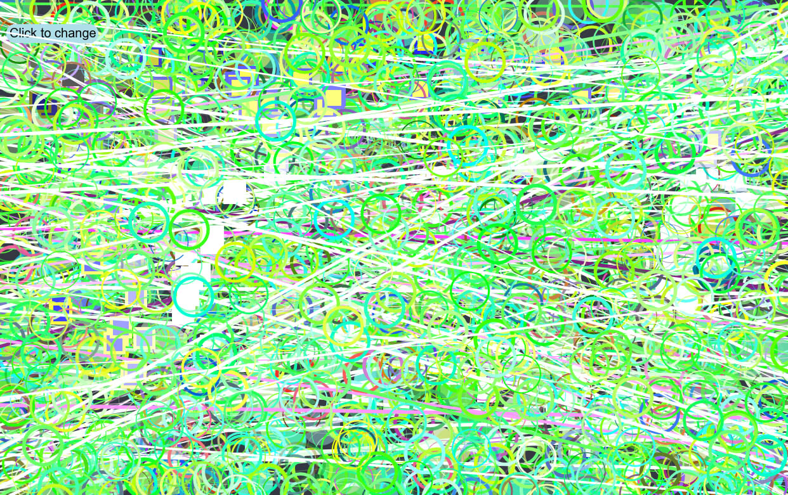

### Manuela Cardenas de la Miyar, 50

#### [Functions & Arrays Sketch](https://dmecam.github.io/120-work/hw-10/)

# Homework week 10

During this week I created a sketch with functions and arrays. I learned how to use an array and the different commands I can use in order to manipulate it, like `push` and `splice`. Also, I created my own functions (`backgroundChange()`, `inst()`, `randomLine(posY, posY2)` and `newCursor()`) and loops.

## Process

In order to complete my assignment I took the following steps:

1. I read all the information about the process of the assignment. I saw all the videos and followed all the instructions.
2. I duplicated the empty-example directory and renamed it (hw-10).
3. I decided to create a new creative sketch, that utilizes functions and arrays because I thought I would have more possibilities to use the new concepts.
3. I started creating the canvas with `windowWidth` and `windowHeight`.
4. I defined the variables (I tried to use `let` in the majority of them) and the arrays.
5. I changed the frame rate and I used `if`, `else`, `else if` and `for`.
6. Finally, I added the `mousePressed` function to change the background and the elements when the `clicks` value is updated.

## Problems

This week I only had minor problems, like a misspelling or a missing a symbol. So, I solved it opening the error console and checking the code a second time.

This week I participated in the forum in order to try to solve one problem. I used the error console and changed several parts of the code to fix it.

I have been reading about arrays in order to learn more about them.

## Future Work

In the future, I will be able to work with arrays, manipulate them and create my own functions without problems.

## Images

This is what my final sketch looked like.

