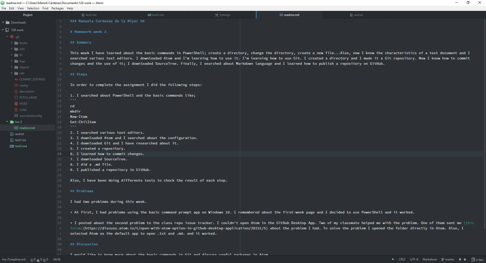

### Manuela Cardenas de la Miyar 50

# Homework week 2

## Summary

This week I have learned about the basic commands in PowerShell; create a directory, change the directory, create a new file...Also, now I know the characteristics of a text document and I searched various text editors. I downloaded Atom and I'm learning how to use it. I'm learning how to use Git. I created a directory and I made it a Git repository. Now I know how to commit changes and the use of it; I downloaded SourceTree. Finally, I searched about Markdown language and I learned how to publish a repository on GitHub.

## Steps

In order to complete the assignment I did the following steps:

1. I searched about PowerShell and the basic commands like;
```
cd
mkdir
New-Item
Get-ChilItem
```
2. I searched various text editors.
3. I downloaded Atom and I searched about the configuration.
4. I downloaded Git and I have researched about it.
5. I created a repository.
6. I learned how to commit changes.
7. I downloaded SourceTree.
8. I did a .md file.
9. I published a repository in GitHub.

Also, I have been doing differents tests to check the result of each step.

## Problems

I had two problems during this week.

+ At first, I had problems using the basic command prompt app on Windows 10. I remembered about the first-week page and I decided to use PowerShell and it worked.

+ I posted about the second problem to the class repo issue tracker. I couldn't open Atom in the GitHub Desktop App. Two of my classmate helped me with the problem. One of them sent me [this forum](https://discuss.atom.io/t/open-with-atom-option-in-github-desktop-application/20251/5) about the problem I had. To solve the problem I opened the folder directly in Atom. Also, I selected Atom as the default app to open .txt and .md. and it worked.

## Discussion

I would like to know more about the basic commands in Git and discuss useful packages in Atom.

## Help

I helped one of my classmates with a problem in the first step of the assignment; I had that same problem at the beginning too.



