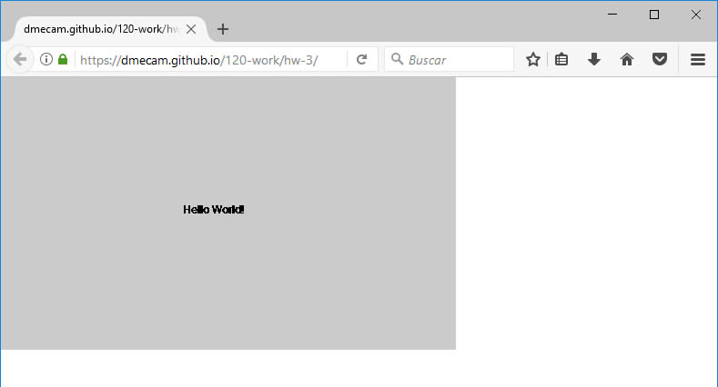

### Manuela Cardenas de la Miyar, 50

["Hello World!" Sketch](https://dmecam.github.io/120-work/hw-3/)

# Homework week 3

During this week I started to learn p5 and I created my first p5 sketch!

## Process

In order to complete my assignment I took the following steps:

1. I read all the information about the process of the assignment. I saw all the videos and followed all the instructions.
2. I created all the new directories that I was going to need using PowerShell. I downloaded, duplicated and rename the empty example to have several directories with the same content.
3. I modified each copy in order to complete all the steps.
4. I played with the options of each function to know the meaning of them and to learn about it. Also, I searched for them in the p5 reference page.
5. Finally, I chose for my p5 sketch canvas a grey background (203) and a size of 500px wide and 300px high.

## Problems

This week, unlike the last one, I didn't have any problems with the assignment nor the programs. I followed each step and everything was working! So, I didn't create any post.

I wanted to help my classmates in the class repo issue tracker but the majority of the problems were already solved (I'm glad they found a solution) or I don't know how to solve them.

I found that the p5 reference page is really useful and I have been exploring in order to know more about the possibilities that I have.

## Images

This is what my final sketch looked like.

