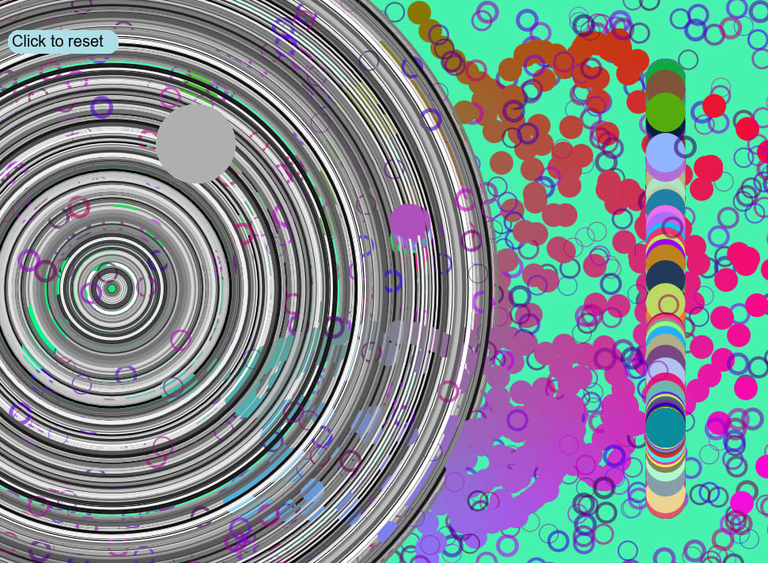

### Manuela Cardenas de la Miyar, 50

#### [Algorithmic Sketch](https://dmecam.github.io/120-work/hw-6/)

# Homework week 6

During this week I created a sketch with algorithms. In order to commit it I learned how to use math functions like `floor()` or `constrain()`. Also, I learned how to use the `map()` function, the `random()` function and how to store more than one variable inside a variable with a JavaScript object.

## Process

In order to complete my assignment I took the following steps:

1. I read all the information about the process of the assignment. I saw all the videos and followed all the instructions.
2. I duplicated the empty-example directory and renamed it (hw-6).
3. I decided to create an abstract image that changes over time because I thought I would have more possibilities choosing the shapes, the position of them and the colors.
3. I started creating the canvas with `windowWidth` and `windowHeight`.
4. I created my own variables and defined them. Also, I decided to create the background in the `setup()` function.
5. Once I have the variables I started doing math operators in order to create different effects.
6. I used global variables and I changed them, math functions like `constrain()` and `floor`, I realized math operations (I also used the modulo), I generated several random numbers with `random()` and I used the `map()` function.
7. Finally, I added the `mousePressed` function to change the background with a random color.

## Problems

This week I only had minor problems, like a misspelling or a missing a symbol. So, I solved it opening the error console and checking the code a second time.

I wanted to help my classmates in the class repo issue tracker but the majority of the problems were already solved (I'm glad they found a solution) or I don't know how to solve them.

I have been reading the p5 reference page in order to learn more about each function (especially about `mousePressed`).

## Future Work

In the future, I will be able to work with math functions and be able to solve algorithms without problems.

## Images

This is what my final sketch looked like.

