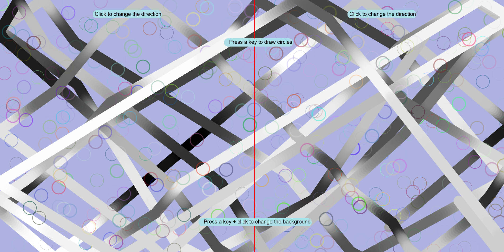

Manuela Cardenas de la Miyar, 50

[Live Sketch Link](https://dmecam.github.io/120-work/hw-7/)


# HW 7 | Describe then Alter the Bouncing Ball

## Description of What the Original Code is Doing

The original code draws a ball that moves in the canvas (`windowWidth, 400`) and when it's going out of the screen, it changes his direction.
If we click, the speed and the direction of the ball change one time.

It is working the way it is because it uses conditionals (`if`) in order to change the situation of the ball and his assigned values when a certain requirement is accomplished (i.e. `mousePressed`).

The original code with comments is posted bellow.

In order to change the ball direction, you have to reassign a value in the following variables (`ball.scale_y` `ball.scale_x`) and create a condition to trigger the change.

```
//define an object
var ball = {};
//assign qualities to the object
ball.width = 40;
ball.x = 10;
ball.y = 10;
ball.delta_x = 1;
ball.delta_y = 1;
ball.scale_x = 1;
ball.scale_y = 1;

function setup() {
  //creates the canvas
    createCanvas(windowWidth, 400);
    //set the background color
    background(255);
}


function draw() {

    //the x is incremented
    ball.x += ball.delta_x * ball.scale_x;
    //the y is incremented
    ball.y += ball.delta_y * ball.scale_y;

    //first condition. If the position of the ball in the x axis is greater or equal than the width or, if the position of the ball in the x axis is less or equal than 0, it activates the following action
    if (ball.x >= width || ball.x <= 0) {
        //the ball.delta_x is assigned with the opposite value, if it is possitve, it changes to negative, or vice versa
        ball.delta_x = -1 * ball.delta_x;
    }

    //if the position of the ball in y axis is greater or equal than the height, or if the position of the ball is less or equal to 0, it activates the following action
    if (ball.y >= height || ball.y <= 0) {
        //the ball.delta_x is assigned with the opposite value, if it is possitve, it changes to negative, or vice versa
        ball.delta_y = -1 * ball.delta_y;
    }
    //remove the stroke
    noStroke();
    //set the shape color
    fill(255);
    //draw the ball
    ellipse(ball.x, ball.y, ball.width, ball.width);
}

// it activates when the mouse is pressed (only one time, to keep the action while the mouse is pressed the function that we need is mouseIsPressed)
function mousePressed() {
    //creates a map and change the movement of the ball
    ball.scale_x = map(mouseX, 0, width, 0.5, 10);
    ball.scale_y = map(mouseY, 0, height, 0.5, 10);
}

```
<!--
--This is a Comment Block--

Please describe what the original code is doing.

Why is it working the way it is?
What does each line do?
How can you make the ball change direction?

-->


## How did you alter the sketch?

In order to alter the sketch, I followed this steps
1. At the beginning, I decided to start changing details like the color of the ball (it depends on the position of the mouse)
2. I add a condition to the movement and I assigned a value in each case.
3. Also, I wanted to practice with new functions (`KeyIsPressed`).
4. I decided to combine two requirements (`mousePressed` and `keyIsPressed`) and complete them with a condition.
5. Finally, I added text with all the commands.

```
//define a variable (to assign the color)
var col = 0;
//define the object ball
var ball = {};
//assign qualities to the object
ball.width = 40;
ball.x = 10;
ball.y = 10;
ball.delta_x = 1;
ball.delta_y = 1;
ball.scale_x = 1;
ball.scale_y = 1;

function setup() {
    //creates the canvas
    createCanvas(windowWidth, windowHeight);
    //set the background color
    background(255);
}

//declare avarible (set a value for the keyIsPressed() function)
var value = 0;

function draw() {

    //the x is incremented
    ball.x += ball.delta_x * ball.scale_x;
    //the y is incremented
    ball.y += ball.delta_y * ball.scale_y;

    //first condition. If the position of the ball in the x axis is greater or equal than the width or, if the position of the ball in the x axis is less or equal than 0, it activates the following action
    if (ball.x >= width || ball.x <= 0) {
        //the ball.delta_x is assigned with the opposite value, if it is possitve, it changes to negative, or vice versa
        ball.delta_x = -1 * ball.delta_x;
    }
    //if the position of the ball in y axis is greater or equal than the height, or if the position of the ball is less or equal to 0, it activates the following action
    if (ball.y >= height || ball.y <= 0) {
      //the ball.delta_x is assigned with the opposite value, if it is possitve, it changes to negative, or vice versa
        ball.delta_y = -1 * ball.delta_y;
    }

    col = map ( mouseX, 0, width, 0, 255 );
    //set the shape color
    fill(col);
    //remove the stroke
    noStroke();
    //draw the ellipse
    ellipse(ball.x, ball.y, ball.width, ball.width);

    //if a key is pressed it activates the following actiom
    if (keyIsPressed === true) {
      //remove the fill
      noFill();
      //set the strokeWeight a random value (max 5)
      strokeWeight( random(5) );
      //assign a random color to the stroke
      stroke( random(256), random(256), random(256), random(150));
      //draw the shape
      ellipse( random(width), random(height), 50, 50);
    }

    //draw a line to divide the sreen
    stroke('red');
    strokeWeight(2);
    line( windowWidth / 2, 0, windowWidth / 2, height );

    //all the text and the blue rectangles
    noStroke();
    fill ('rgb(174, 223, 233)');
    rect( width * 0.25 - 130, 39, 260, 30, 50);

    fill ( 0 );
    textSize ( 20 );
    text( "Click to change the direction", width * 0.25 - 123, 60);

    noStroke();
    fill ('rgb(174, 223, 233)');
    rect( width * 0.75 - 130, 39, 260, 30, 50);

    fill ( 0 );
    textSize ( 20 );
    text( "Click to change the direction", width * 0.75 - 123, 60);

    noStroke();
    fill ('rgb(174, 223, 233)');
    rect( width * 0.44, height * 0.15, 260, 30, 50);

    fill ( 0 );
    textSize ( 20 );
    text( "Press a key to draw circles", width * 0.45, height * 0.15 + 20);

    noStroke();
    fill ('rgb(174, 223, 233)');
    rect( width * 0.39 , height * 0.85, 426, 30, 50);

    fill ( 0 );
    textSize ( 20 );
    text( "Press a key + click to change the background", width * 0.4, height * 0.85 + 20);
}

// it activates when the mouse is pressed (only one time, to keep the action while the mouse is pressed the function that we need is mouseIsPressed)
function mousePressed() {

  // if the position of the mouse in the x axis is greater or equal to the half of the width it activates the following actions
  if( mouseX >= width / 2) {
    //creates a map and change the speed and the direction of the ball
    ball.scale_x = map(mouseX, 0, width, 0.5, 10);
    ball.scale_y = map(mouseY, 0, height, 0.5, 10);

    //if not it activates the following actions
} else {
  //creates a map and change the speed and the direction of the ball
  ball.scale_x = map(mouseX, 10, width, 2, 5);
  ball.scale_y = map(mouseY, 10, height, 2, 5);
}

//if a key (and the mouse) is pressed it activates the following action
if(keyIsPressed === true){
  //it set a random color for the background
  background(random(256), random(256), random(256));
}
}

```



<!--
Please describe how and why you changed the sketch?
-->
