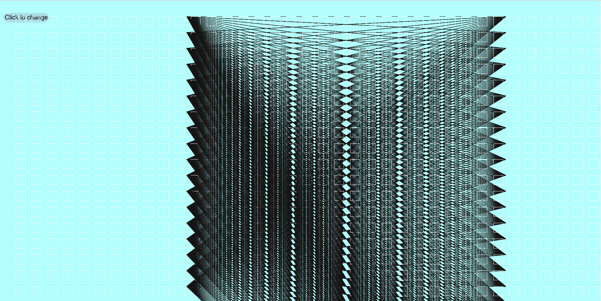

### Manuela Cardenas de la Miyar, 50

#### [Loops Sketch](https://dmecam.github.io/120-work/hw-8/)

# Homework week 8

During this week I learned how to create and use loops with `for` and `while`. Also, I started to use `let` to define variables.

## Process

In order to complete my assignment I took the following steps:

1. I read all the information about the process of the assignment. I saw all the videos and followed all the instructions.
2. I duplicated the empty-example directory and renamed it (hw-8).
3. I decided to create a new creative sketch, that utilizes loops.
3. I defined the variables with `let`.
4. I created several loops to practice and I decided to define a variable (`clicks`) that updates each time that the mouse is pressed, returning a different loop with each value.

## Problems

This week I only had minor problems, like a misspelling or a missing a symbol. So, I solved it opening the error console and checking the code a second time. Also, I committed an error saving this readme; I saved it in another directory, but it is solved.

I wanted to help my classmates in the class repo issue tracker but the majority of the problems were already solved (I'm glad they found a solution) or I don't know how to solve them.

I have been reading about loops and `let` in order to learn more about them.

## Future Work

In the future, I will be able to work with loops and manipulate them without problems.

## Images

This is what my final sketch looked like.

